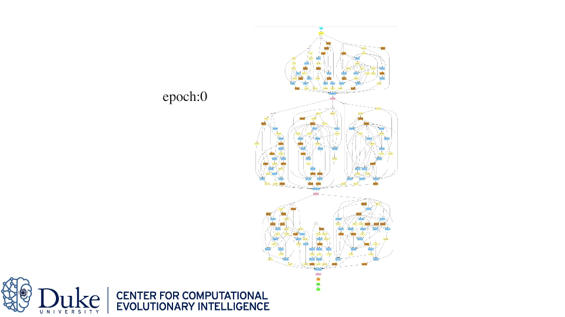

# SwiftNet: Using Graph Propagation as Meta-knowledge to Search Highly Representative Neural Architectures [[arXiv]](https://arxiv.org/abs/1906.08305)

```bash
@article{DBLP:journals/corr/abs-1906-08305,
  author    = {Hsin{-}Pai Cheng and
               Tunhou Zhang and
               Yukun Yang and
               Feng Yan and
               Shiyu Li and
               Harris Teague and
               Hai Li and
               Yiran Chen},
  title     = {SwiftNet: Using Graph Propagation as Meta-knowledge to Search Highly
               Representative Neural Architectures},
  journal   = {CoRR},
  volume    = {abs/1906.08305},
  year      = {2019},
  url       = {http://arxiv.org/abs/1906.08305},
  archivePrefix = {arXiv},
  eprint    = {1906.08305},
  timestamp = {Mon, 24 Jun 2019 17:28:45 +0200},
  biburl    = {https://dblp.org/rec/bib/journals/corr/abs-1906-08305},
  bibsource = {dblp computer science bibliography, https://dblp.org}
}
```


<p align="center">

</p>
